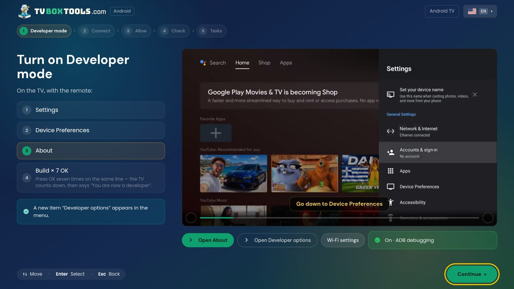
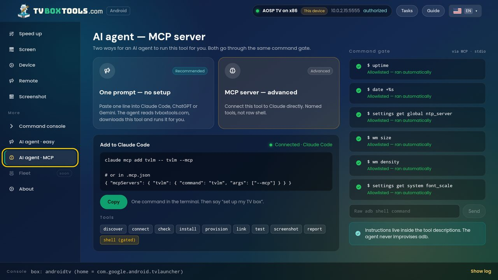
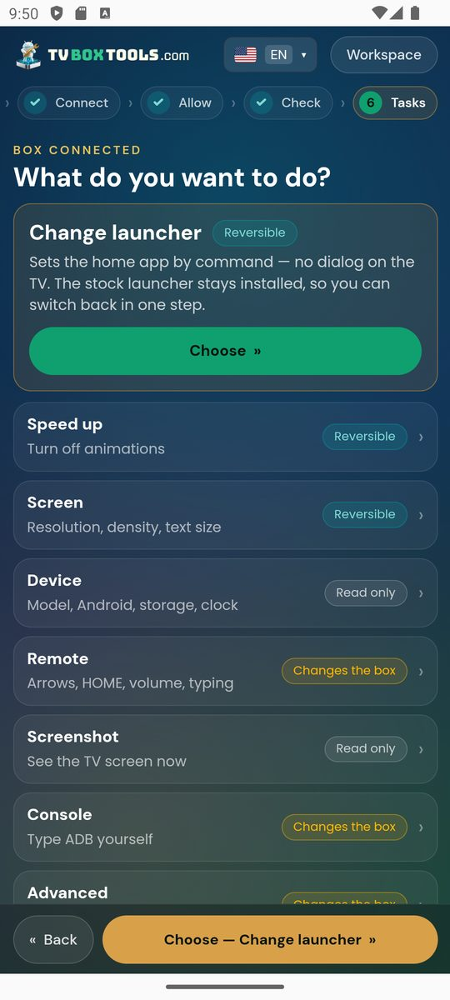
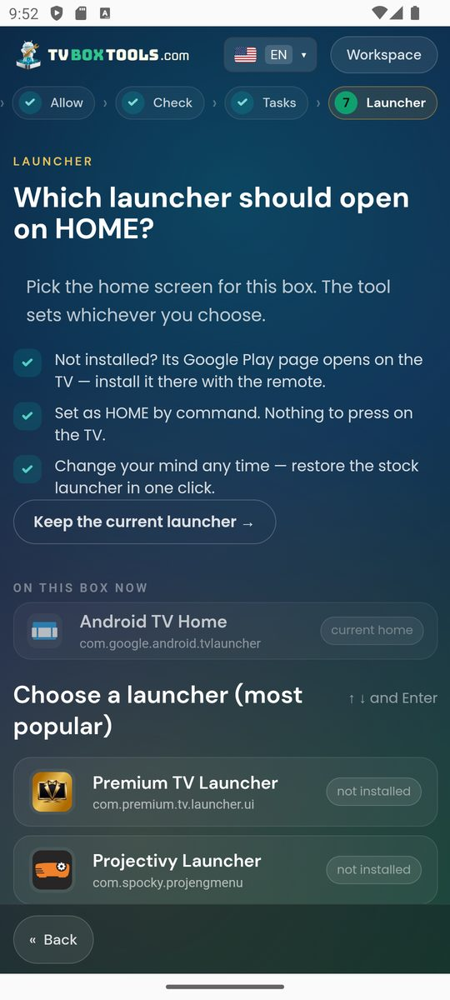
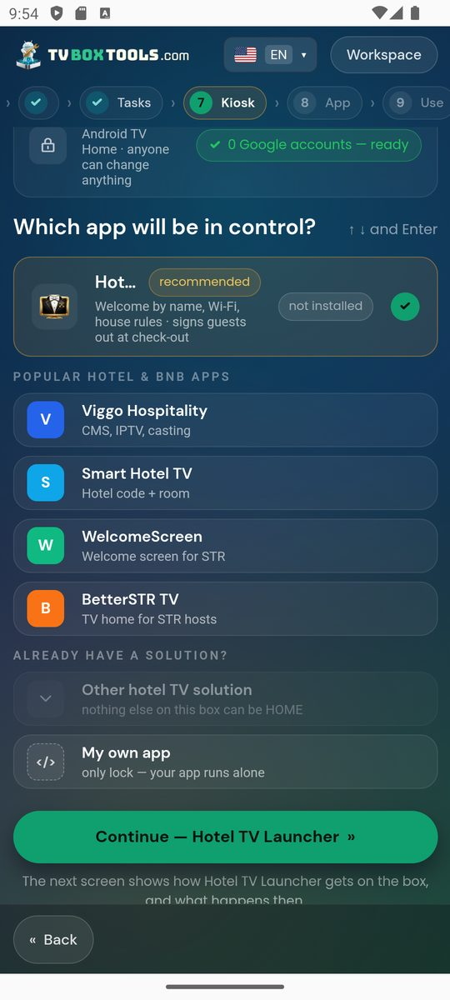
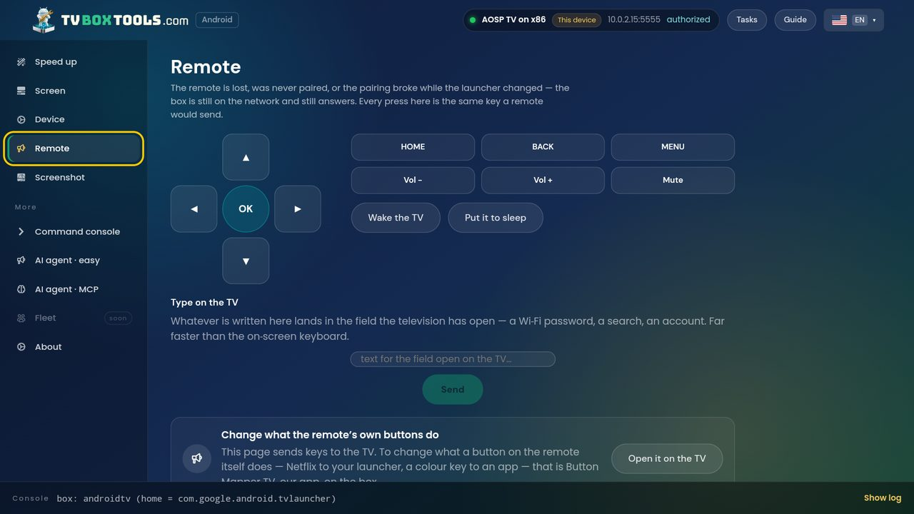
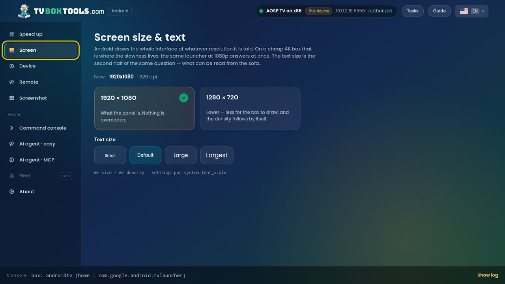

# TV Box Tools

**TV Box Tools is a launcher manager and ADB toolbox for Android TV and Google TV boxes.** It sets
which app opens when you press HOME, keeps it there after reboots, and does the everyday box jobs
(speed-up, display, remote, device info, screenshot, console, kiosk) through a guided wizard —
from Windows, macOS, Linux, a phone, a browser tab, or on the TV itself. No root. The stock
launcher is never removed; one tap puts it back. Apache-2.0.

- Site and downloads: **[tvboxtools.com](https://tvboxtools.com)** · web app: [tvboxtools.com/setup](https://tvboxtools.com/setup)
- Current version: **1.26.10.01** (1 October 2026) · Windows · macOS (Apple Silicon and Intel) · Linux · Android
- On Google Play: **[TV Box Tools – Setup Manager](https://play.google.com/store/apps/details?id=com.tv.launcher.manager.adb.tvboxtools)** (live since 1 October 2026) · sideload and desktop builds: [tvboxtools.com](https://tvboxtools.com)
- For AI agents: `tvlm --mcp` (MCP server) and `tvlm` CLI — see [docs/ai-agents.md](docs/ai-agents.md)
- Publisher: [Smartago](https://smartago.net) (Jim Dimos, founder) — the makers of Premium TV Launcher, Hotel TV, Button Mapper TV and Universal Manager

<p align="center">
  
</p>

## What problem does it solve?

Android TV has no "default launcher" setting. Third-party launchers — Projectivy, AT4K, Monet,
FLauncher and the others — are excellent, but most of them keep the HOME button through an
**accessibility service**, and some TVs switch that service off after a full restart or a system
update. The symptom people report: *"my launcher forgets itself and the stock Google TV home comes
back after a reboot."*

TV Box Tools does the durable thing. It sets your launcher as the HOME app with a **system
command** (`cmd package set-home-activity`) over the box's own debugging connection, verifies the
box actually accepted it, and stops. Nothing runs in the background, no accessibility trick, no
loop that disables the stock launcher. Change your mind later and one tap restores the stock
launcher — it was never uninstalled.

## What can it do?

| Job | What it does | Reversible |
|---|---|---|
| **Change launcher** | Pick any installed launcher (or one from Google Play, opened on the TV) as the HOME app | yes, one tap |
| **Kiosk** | Lock a box to one app for a room, shop or lobby: Device Owner, persistent HOME, maintenance PIN | yes |
| **Speed up** | Turn animations off | yes |
| **Screen** | Resolution, density, text size | yes |
| **Device** | Model, Android version, storage, clock — with a clock fix when TLS downloads fail | read-only |
| **Remote** | Arrows, HOME, volume and typing from a phone or PC — when the remote is lost or never paired | — |
| **Screenshot** | See the TV screen now | read-only |
| **Console** | Type ADB yourself, behind the command gate | gated |
| **Debloat · Install APK · Backup · Free space** | Desktop, web and sideload builds only — never in the Google Play edition | yes |
| **AI agent** | The same engine as a CLI and an MCP server: discover, pair, connect, check, install, provision, link, test, screenshot, report, shell | gated |

## How does it stay safe?

Every command goes through one **command gate** ([`packages/core/src/gate.ts`](packages/core/src/gate.ts)):

| Class | Examples | What happens |
|---|---|---|
| read | `getprop`, `dumpsys`, `pm list` | runs at once |
| reversible setting | `settings put`, `wm size`, `set-home-activity` | shown, then run |
| change to the box | `pm disable-user`, `pm install`, `dpm set-device-owner` | shown, asks first |
| destructive | `su`, `wipe`, factory reset, bootloader, `adb_enabled 0` | **refused** — never runs |

The steps a task runs are **data**, not code: [`packages/core/src/steps.ts`](packages/core/src/steps.ts)
lists every command, what counts as success, and what to say when it fails. You can read the
whole of what the tool is able to do to a box in those two files.

Everything travels over Developer options › USB or network debugging, which you switch on yourself
(the wizard shows the real TV menus while you do). No root. No account. No tracking of what you
watch; the app reports anonymous install and error statistics only —
[privacy policy](https://tvboxtools.com/privacy/).

## Which devices and platforms?

- **Boxes:** Android TV 7+ and Google TV — Nvidia Shield, Xiaomi Mi Box and Mi TV Stick, Chromecast
  with Google TV, Sony, TCL, Hisense and most Android TV boxes. Fire TV over ADB debugging.
- **Runs on:** Windows (installer and portable), macOS (Apple Silicon and Intel), Linux (tar.gz),
  Android (phone, tablet, or the TV itself), and Chrome (WebUSB for USB; Wi-Fi through the desktop app).
- **Connections:** USB, Wi-Fi ADB on port 5555, Android 11+ wireless debugging with pairing code.
  Boxes on the network are found by mDNS and a subnet scan.
- **Languages:** English, Greek.

Stable download links (always the latest build):
[`tv-launcher-manager-setup.exe`](https://tvboxtools.com/dl/tv-launcher-manager-setup.exe) ·
[`tv-launcher-manager-mac-arm64.dmg`](https://tvboxtools.com/dl/tv-launcher-manager-mac-arm64.dmg) ·
[`tv-launcher-manager-mac-intel.dmg`](https://tvboxtools.com/dl/tv-launcher-manager-mac-intel.dmg) ·
[`tv-launcher-manager-linux.tar.gz`](https://tvboxtools.com/dl/tv-launcher-manager-linux.tar.gz) ·
[`tv-launcher-manager.apk`](https://tvboxtools.com/dl/tv-launcher-manager.apk)

On Fire TV, or any box where typing a URL with the remote is painful, the Android build also has a
**Downloader code: `2123033`** — it always resolves to the latest APK above.

## How do AI agents use it?

```bash
claude mcp add tvlm -- tvlm --mcp        # or in .mcp.json: {"mcpServers":{"tvlm":{"command":"tvlm","args":["--mcp"]}}}
```

Then say *"set up my TV box"*. The MCP server exposes named tools — `discover`, `pair`, `connect`,
`check`, `install`, `provision`, `link`, `test`, `screenshot`, `report` and a gated `shell` — and the
instructions live inside the tool descriptions, so the agent never improvises adb. The same gate
applies. Details, the one-prompt route without any setup, and the CLI: [docs/ai-agents.md](docs/ai-agents.md)
and [tvboxtools.com/boxsetupai](https://tvboxtools.com/boxsetupai).

<p align="center">
  
</p>

## Screenshots

| Tasks (phone) | Launcher picker (phone) | Kiosk (phone) |
|---|---|---|
|  |  |  |

| Remote (on the TV) | Screen size & text (on the TV) |
|---|---|
|  |  |

## FAQ

**Is it free?** Yes. No ads, no in-app purchases, no account.

**Does it need root?** No. It uses the debugging connection you enable in Developer options.

**Will my launcher survive a reboot?** Yes. HOME is set as a system default, not held by a background service.

**Can I go back to the stock launcher?** Yes, one tap. The stock launcher is never uninstalled.

**Does it work with Projectivy, AT4K, Monet or FLauncher?** Yes — with any launcher installed on the box. The tool ships no launcher of its own; Premium TV Launcher (ours) is one row in the list.

**Fire TV?** Yes, over ADB debugging.

**Why does the Google Play edition do less?** By our own rule: a copy that came from Google Play installs nothing and switches nothing off. Debloat, APK install, backup and free-space live in the desktop, web and sideload builds.

**Is there a command-line or AI version?** Yes: the `tvlm` CLI and an MCP server, same engine, same gate.

**Is it really open source?** Yes — this repository is the code that ships, under Apache-2.0. The names and logos are trademarks, see [TRADEMARKS.md](TRADEMARKS.md).

## Build from source

pnpm workspace: `packages/core` (brand config, steps as data, command gate, engine),
`packages/adb` (ADB transports on Tango: WebUSB, Node TCP/USB, Android socket, mock),
`packages/ui` (Svelte 5 wizard and workspace, EN/EL), `apps/web` (Vite bundle every face ships),
`apps/desktop` (Electron), `apps/android` (Capacitor 8 + Kotlin ADB plugin), `apps/cli` (`tvlm`, MCP).

```bash
pnpm install
cp .env.example .env            # optional: geo key for the language suggestion
pnpm dev                        # web app on a mock box: ?lang=en|el&scenario=…
pnpm test && pnpm -r check
pnpm --filter @tvlm/desktop dist:launcher   # Windows installer + portable
pnpm --filter @tvlm/desktop dist:linux
pnpm --filter @tvlm/desktop dist:mac        # on a Mac: arm64 + x64 dmg
pnpm --filter @tvlm/android sync:launcher   # then gradle in apps/android/android
```

Release builds of the Android app need a signing key that is **not** in this repository
([keystore/README.md](keystore/README.md)); a pre-commit hook refuses commits that look like keys.

## Licence

Code: [Apache-2.0](LICENSE) © 2026 Smartago. Names, logos and brand material: [TRADEMARKS.md](TRADEMARKS.md).
Projectivy, AT4K, Monet, FLauncher, Android TV, Google TV and Fire TV are trademarks of their owners;
TV Box Tools is not affiliated with any of them.
